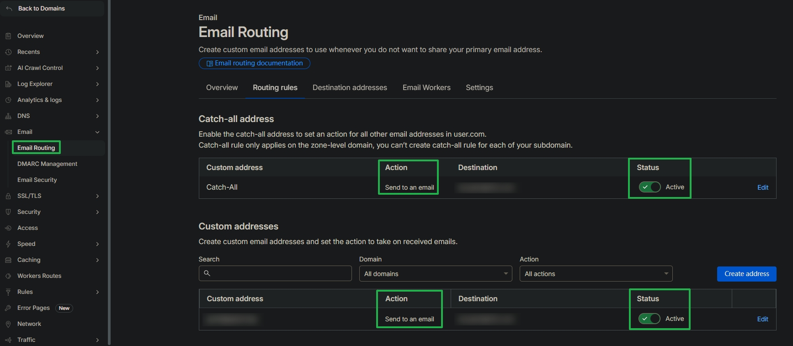

# 搭建域名邮箱

::: tip 0基础低成本域名邮箱搭建指南：
- https://linux.do/t/topic/1411782
 
【教程】小白也能看懂的自建Cloudflare临时邮箱教程（域名邮箱）：
- https://linux.do/t/topic/316819
:::

## 步骤A (只接收邮件): Cloudflare Email Routing

- 功能：任意域名邮箱都能收验证码，无需登录邮箱网页看收件箱
- 缺点：<m>无法发送邮件</m>
- 方法：Cloudflare Email Routing + Catch-all 规则

### A0. 前置准备

- 一个自有域名，假设为 `ABC.com`
- 一个 Cloudflare 账号（Free 计划即可）
- 一个在用的目标邮箱，假设为 `YYY@EFG.com`，用于接收转发邮件

### A1. 把域名托管到 Cloudflare

访问 Cloudflare 控制台：
- https://dash.cloudflare.com

选择 `Domain registration` → `Transfer Domains`：
- 点击 `Onboard a domain`
- 输入域名，点击 `Continue`
- 会提示 `That domain has already been added to your account. Go to BBB.CCC overview`

点击进入该域名管理界面：
- 点击左侧的 `DNS` → `Records`，可以看到下面的 `Cloudflare Nameservers`
- 复制这两个 NS

去域名注册商后台，以 阿里云 为例：
- https://dc.console.aliyun.com/
- 进入域名控制台，点击 `全部域名`
- 选择目标域名，点击最右侧的 `管理`
- 选择 `DNS 管理` → `DNS修改`，点击 `修改DNS服务器`
- 将 NS 修改为 Cloudflare 给的两条 NS，点击 `确定`
- 输入手机验证码，等待 NS 生效

托管成功后，可以在 Cloudflare 的 DNS 页面右上角看到 `DNS Setup` 的状态为 `Full`。

### A2. 开启 Email Routing，添加目标地址

在 Cloudflare 域名管理界面：
- 点击左侧的 `Email` → `Email Routing`，点击 `Get started`
- 在 `Custom address` 填写邮箱前缀，比如 `XXX@ABC.com`
- 在 `Destination` 中填写最终接收邮件的目标邮箱地址 `YYY@EFG.com`
- 点击 `Create and continue`
- 会出现 `Verify destination address` 页面，`Status` 为 `Pending verification`
- 等待一会，然后在目标邮箱里找到 Cloudflare 发来的验证邮件，点击里面的 `Verify email address` 链接完成验证
- 验证成功后会提示 `Your email address is now verified`

### A3. 配置 Catch-all 全转发规则

在 Cloudflare 域名管理界面：

- 点击左侧的 `Email` → `Email Routing`
- 点击 `Routing rules`，将 `Catch-All` 的 `Status` 切换为 `Active`
- 点击 `Enable routing ...`，选择 `Enable ...`
- 点击 `Catch-all address` 最右侧的 `Edit`
  - 将 `Action` 选择为 `Send to an email`
  - 将 `Destination` 选择为刚刚验证的目标邮箱地址

配置好后，任何发往 `XXX@ABC.com` 的邮件都会被转发到目标邮箱 `YYY@DEF.com`。

### A4. 说明

配置成功后如图所示：

测试：

* 用任意外部邮箱给 `XXX@ABC.com` 发一封邮件，确认目标邮箱 `YYY@DEF.com` 可以收到转发
* Catch-all 允许“无限别名”，容易吃到垃圾邮件，必要时可以用黑名单/只开特定前缀规则
* Email Routing 的本质是收件转发
* 如果想通过域名邮箱发送邮件，则需要额外发信服务，可以参考步骤 B

## 步骤 B (可发送邮件): CF Workers + D1 + Pages + Email Routing

功能：
- 有网页前端可创建邮箱地址、看收件箱
- 后端可管理、可扩展发信（Resend/SMTP）、IMAP/SMTP 代理、Telegram 推送等

 
<m>以下步骤尚待实践验证，点击展开</m>

### B0. 前置准备

* 域名已托管到 Cloudflare（同步骤 A 的 A1）。([LINUX DO][5])
* Cloudflare Workers/D1 可用：D1 在 Free 计划也可用（有额度限制）。([Cloudflare Docs][6])
* 建议准备两个子域名（可选但强烈推荐）：

  * `api.yourdomain.com` → Worker 后端
  * `mail.yourdomain.com` → Pages 前端
* **中国网络环境注意**：`*.workers.dev` 在部分地区可能不可访问，官方文档也建议用自定义域名。([Temp Mail][7])

## B1. 创建并初始化 D1 数据库

1. Cloudflare 控制台 → **Storage & Databases → D1** → Create Database。([Temp Mail][8])
2. 初始化数据库：

   * 打开 D1 数据库的 **Console** 标签页
   * 把仓库的 `db/schema.sql` 内容粘贴进去并 Execute。([Temp Mail][8])

> 也可以先不初始化，部署完后在 admin 的“快速设置→数据库”里点“初始化数据库”。([Temp Mail][8])

## B2. 部署 Workers 后端（API）

按官方 UI 部署步骤（与你贴子截图流程一致）：([Temp Mail][7])

1. **Compute → Workers & Pages → Create → Worker → Create Worker**，改名后 Deploy。([Temp Mail][7])

2. Settings → Runtime：

   * 在 **Compatibility flags** 加 `nodejs_compat`
   * Compatibility date 设到文档要求的日期之后。([Temp Mail][7])

3. 替换代码：

   * 下载仓库提供的 `worker.js`
   * Worker → Overview → Edit Code → 删除默认文件 → Upload `worker.js` → Deploy。([Temp Mail][7])

4. 配置变量（Settings → Variables and Secrets）
   **最小可跑集合（建议先这样）：**

   * `DOMAINS`（JSON）：`["你的域名"]`
   * `JWT_SECRET`（文本/Secret）：随机强密钥（用于签发登录/鉴权 JWT）
   * `ADMIN_PASSWORDS`（JSON）：`["一个或多个管理员密码"]`
   * `ENABLE_USER_CREATE_EMAIL`：`true`
   * `ENABLE_USER_DELETE_EMAIL`：`true` ([Temp Mail][7])

   贴子里还建议了（可选）：

   * `DEFAULT_DOMAINS`（未登录用户可用域名）
   * `ADMIN_USER_ROLE` / `USER_ROLES` / `NO_LIMIT_SEND_ROLE` 等角色控制 ([LINUX DO][5])

   **贴子强调的坑：JSON 里的引号要用英文引号**，别从表格直接复制“中文引号”。([LINUX DO][5])

5. 绑定 D1（Settings → Bindings → Add Binding）

   * 类型：D1 Database
   * 绑定名必须叫 **`DB`**
   * 选择你创建的 D1。([Temp Mail][7])

6. （可选）绑定 KV（用于注册用户/邮箱验证等）

   * 创建 KV Namespace
   * Bindings 里绑定名必须叫 **`KV`** ([Temp Mail][7])

7. 配置后端域名（强烈建议）

   * Settings → Triggers（文档写在这里）添加自定义域名
   * 例如 `api.yourdomain.com`，后面前端生成 zip 需要用到这个 URL。([Temp Mail][7])

8. 健康检查

   * 访问 Worker URL 显示 `OK`
   * 访问 `/health_check` 显示 `OK` ([Temp Mail][7])

## B3. 配置 Email Routing：把 Catch-all 投递到 Worker（非常关键）

这一步做完，Worker 才能真正“收邮件”。

1. Cloudflare 控制台 → 你的域名 → Email Routing
2. 按向导配置邮件 DNS 记录（每个域名都要配置一次）。
3. 需要先有至少一个 **已验证的目标邮箱地址**（Cloudflare 的要求：绑定到 Worker 前要启用路由并验证至少一个地址）。
4. Routes → Catch-all address：

   * Action 选择 **Send to a Worker**
   * 选择你刚部署的那个 Worker
   * 保存并启用。

## B4. 部署 Pages 前端（Web 操作界面）

官方文档给了“生成 zip”的方式（贴子里就是这段）：([Temp Mail][9])

1. Compute → Workers & Pages → Create → 选择 **Pages** → **Use direct upload**。([Temp Mail][9])
2. 在文档提供的“前端生成器”里输入你的 Worker 后端 URL（**不要带末尾 `/`**），生成并下载 zip。([Temp Mail][9])
3. Pages 创建项目 → 上传 zip → Deploy。([Temp Mail][9])
4. （可选但推荐）给 Pages 绑自定义域名：`mail.yourdomain.com`

## B5. Admin 控制台入口与权限

* 需要配置 `ADMIN_PASSWORDS` 或 `ADMIN_USER_ROLE` 才能进 admin。([Temp Mail][10])
* 进入方式：

  * 前端页面左上角 logo **点 5 次**，或直接访问 `/admin`。([Temp Mail][10])

## B6. 端到端测试清单

1. 打开前端站点 → 创建一个邮箱地址（如 `abc@你的域名`）
2. 用外部邮箱发信到该地址
3. 前端收件箱能看到邮件内容/验证码（如启用解析/AI 提取则会更强）([GitHub][11])

## B7. （可选）配置“发邮件”

贴子里也补了“发信要额外配”的说明；官方文档明确：可同时配置多种方式，优先用 Resend，其次 SMTP。([LINUX DO][5])

### 方式 1：Resend（推荐，最省心）

* 在 Resend 添加你的域名并按提示加 DNS 记录
* 创建 API key
* 在 Worker 的 Secrets 里加 `RESEND_TOKEN`（UI 部署就直接在 Variables and Secrets 里加 secret）。([Temp Mail][12])

### 方式 2：SMTP（你自备 SMTP 服务）

* 配 `SMTP_CONFIG`（JSON，按域名分配 SMTP 参数），放到 Secrets。([Temp Mail][12])

## B8. （可选）IMAP/SMTP：用 Thunderbird 等客户端登录

如果你想用传统邮箱客户端（IMAP/SMTP），官方提供了一个 **SMTP/IMAP Proxy Server**（本地跑或 Docker 跑），然后客户端用“邮箱地址凭证”当密码登录。([Temp Mail][13])

## 步骤 C（补充）：idinging/freemail（你第一个贴子提到的替代项目）

第一个贴子“进阶配置”提到另一个项目 `idinging/freemail`，同样是 Cloudflare Workers + D1 +（可选）R2，带完整功能和一键部署入口；Readme 里也提示“转发地址需要在 Cloudflare Email Addresses 中验证”。
如果你更想要“成体系的域名邮箱系统（用户管理/转发/收藏等）”，可以评估这个作为替代。

[1]: https://linux.do/t/topic/1411782 "0基础低成本域名邮箱搭建指南 - 搞七捻三 - LINUX DO"
[2]: https://temp-mail-docs.awsl.uk/zh/guide/email-routing.html "Cloudflare Email Routing | 临时邮箱文档"
[3]: https://developers.cloudflare.com/email-routing/setup/email-routing-addresses/?utm_source=chatgpt.com "Configure rules and addresses · Cloudflare Email Routing ..."
[4]: https://theadminbar.com/free-custom-domain-email-addresses-with-cloudflare-email-forwarding/?utm_source=chatgpt.com "Easily Set Up Email Forwarding with Cloudflare Today"
[5]: https://linux.do/t/topic/316819 "〖教程〗小白也能看懂的自建Cloudflare临时邮箱教程（域名邮箱） - 文档共建 - LINUX DO"
[6]: https://developers.cloudflare.com/workers/platform/pricing/?utm_source=chatgpt.com "Pricing · Cloudflare Workers docs"
[7]: https://temp-mail-docs.awsl.uk/zh/guide/ui/worker.html "Cloudflare workers 后端 | 临时邮箱文档"
[8]: https://temp-mail-docs.awsl.uk/zh/guide/ui/d1.html "初始化/更新 D1 数据库 | 临时邮箱文档"
[9]: https://temp-mail-docs.awsl.uk/zh/guide/ui/pages.html "Cloudflare Pages 前端 | 临时邮箱文档"
[10]: https://temp-mail-docs.awsl.uk/zh/guide/feature/admin.html "Admin 控制台 | 临时邮箱文档"
[11]: https://github.com/dreamhunter2333/cloudflare_temp_email "GitHub - dreamhunter2333/cloudflare_temp_email: CloudFlare free temp domain email 免费收发 临时域名邮箱 支持附件 IMAP SMTP TelegramBot"
[12]: https://temp-mail-docs.awsl.uk/zh/guide/config-send-mail.html "配置发送邮件 | 临时邮箱文档"
[13]: https://temp-mail-docs.awsl.uk/zh/guide/feature/config-smtp-proxy "搭建 SMTP IMAP 代理服务 | 临时邮箱文档"
