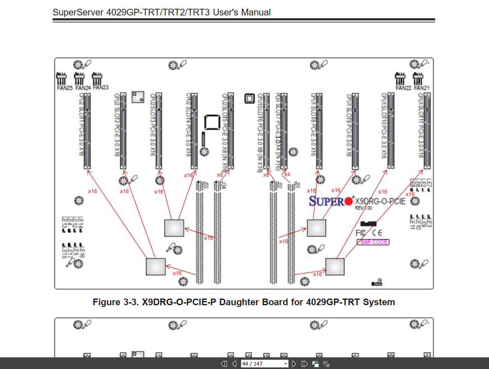

# 查看 NVIDIA 显卡状态

## 查看显卡设备

```sh
lspci -nn | grep -E "VGA|3D|Display"
```

```
00:01.0 VGA compatible controller [0300]: Device [1234:1111] (rev 02)
01:00.0 VGA compatible controller [0300]: NVIDIA Corporation GA102 [GeForce RTX 3080] [10de:2206] (rev a1)
02:00.0 VGA compatible controller [0300]: NVIDIA Corporation GA102 [GeForce RTX 3080] [10de:2206] (rev a1)
03:00.0 VGA compatible controller [0300]: NVIDIA Corporation GA102 [GeForce RTX 3080] [10de:2206] (rev a1)
04:00.0 VGA compatible controller [0300]: NVIDIA Corporation GA102 [GeForce RTX 3080] [10de:2206] (rev ff)
05:00.0 VGA compatible controller [0300]: NVIDIA Corporation GA102 [GeForce RTX 3080] [10de:2206] (rev a1)
06:00.0 VGA compatible controller [0300]: NVIDIA Corporation GA102 [GeForce RTX 3080] [10de:2206] (rev a1)
07:00.0 VGA compatible controller [0300]: NVIDIA Corporation GA102 [GeForce RTX 3080] [10de:2206] (rev a1)
08:00.0 VGA compatible controller [0300]: NVIDIA Corporation GA102 [GeForce RTX 3080] [10de:2206] (rev a1)
```

## 列出 PCI 总线 ID

```sh
lspci -Dnnd 10de: | grep -E "0300|0302" | awk '{print $1}' | sort
```

```sh
0000:01:00.0
0000:02:00.0
0000:03:00.0
0000:04:00.0
0000:05:00.0
0000:06:00.0
0000:07:00.0
0000:08:00.0
```

## 列出 NVIDIA GPU

```sh
nvidia-smi --query-gpu=index,pci.bus_id,name --format=csv,noheader | sort
```
```sh
Unable to determine the device handle for GPU3: 0000:04:00.0: Unknown Error
0, 00000000:01:00.0, NVIDIA GeForce RTX 3080
1, 00000000:02:00.0, NVIDIA GeForce RTX 3080
2, 00000000:03:00.0, NVIDIA GeForce RTX 3080
#  Missing :04:00.0
4, 00000000:05:00.0, NVIDIA GeForce RTX 3080
5, 00000000:06:00.0, NVIDIA GeForce RTX 3080
6, 00000000:07:00.0, NVIDIA GeForce RTX 3080
7, 00000000:08:00.0, NVIDIA GeForce RTX 3080
```

对比 `lspci` 和 `nvidia-smi` 的结果，可以看到掉卡的是 `0000:04:00.0`。

## 查看显卡详情

异常卡的信息：

```sh
sudo lspci -vvv -s 0000:04:00.0 | egrep -i "Physical Slot|LnkSta|LnkCap|Kernel driver|Subsystem"
```

```sh{4,5}
Subsystem: NVIDIA Corporation GA102 [GeForce RTX 3080 20GB]
Physical Slot: 0-6
        LnkCap: Port #0, Speed 16GT/s, Width x16, ASPM L0s L1, Exit Latency L0s <512ns, L1 <4us
        LnkSta: Speed 2.5GT/s (downgraded), Width x4 (downgraded)
        LnkCap2: Supported Link Speeds: 2.5-16GT/s, Crosslink- Retimer+ 2Retimers+ DRS-
        LnkSta2: Current De-emphasis Level: -6dB, EqualizationComplete- EqualizationPhase1-
Kernel driver in use: nvidia
```
```sh
# 或者只有一行
Kernel driver in use: nvidia
```

<details open><summary>查看正常卡的信息</summary>

```sh
sudo lspci -vvv -s 0000:05:00.0 | egrep -i "Physical Slot|LnkSta|LnkCap|Kernel driver|Subsystem"
```
```sh{4,5}
Subsystem: NVIDIA Corporation GA102 [GeForce RTX 3080 20GB]
Physical Slot: 0-5
        LnkCap: Port #0, Speed 8GT/s, Width x16, ASPM L0s L1, Exit Latency L0s <512ns, L1 <4us
        LnkSta: Speed 2.5GT/s (downgraded), Width x16 (ok)
        LnkCap2: Supported Link Speeds: 2.5-16GT/s, Crosslink- Retimer+ 2Retimers+ DRS-
        LnkSta2: Current De-emphasis Level: -6dB, EqualizationComplete+ EqualizationPhase1+
Kernel driver in use: nvidia
```

</details>

## 查看绑定驱动

```sh
sudo lspci -nnk -s 0000:04:00.0
```
```sh
04:00.0 VGA compatible controller [0300]: NVIDIA Corporation GA102 [GeForce RTX 3080] [10de:2206] (rev a1)
        Subsystem: NVIDIA Corporation GA102 [GeForce RTX 3080 20GB] [10de:146d]
        Kernel driver in use: nvidia
        Kernel modules: nvidiafb, nouveau, nvidia_drm, nvidia
```

## 在 PVE 中查看 VM 状态

### 列出 VM

```sh
qm list
```
```sh
VMID   NAME      STATUS    MEM(MB)   BOOTDISK(GB)   PID
 101   AI-122    running   94208          2048.00   3544
 301   win10     stopped   65536           500.00   0
```

### 停止 VM

```sh
qm stop 101
```

### 启动 VM

```sh
qm start 101
```

## 在 PVE 中查看 VM GPU 状态

### 列出 Slot 映射

```sh
dmidecode -t slot | awk -F': ' ' /Designation:/ {d=$2} /Bus Address:/ {print $2 "\t" d} ' | sort
```
```sh
0000:00:1c.0    PCH  Slot7 PCI-E 3.0 X4
0000:1a:00.0    CPU1 Slot10 PCI-E 3.0 X16
0000:1b:00.0    CPU1 Slot11 PCI-E 3.0 X16
0000:3d:00.0    CPU1 Slot8 PCI-E 3.0 X16
0000:3e:00.0    CPU1 Slot9 PCI-E 3.0 X16
0000:5d:00.0    CPU1 Slot6 PCI-E 3.0 X8
0000:88:00.0    CPU2 Slot1 PCI-E 3.0 X16
0000:89:00.0    CPU2 Slot2 PCI-E 3.0 X16
0000:b1:00.0    CPU2 Slot3 PCI-E 3.0 X16
0000:b2:00.0    CPU2 Slot4 PCI-E 3.0 X16
0000:d7:02.0    CPU2 Slot5 PCI-E 3.0 X8
```



图中从左到右分别为：
- 4x: `SLOT 1/2/3/4 (3.0x16)`
- 2x: `SLOT 5/6 (3.0x8)`
- 1x: `SLOT 7 (3.0x4)`
- 4x: `SLOT 8/9/10/11 (3.0x16)`

### SLOT 和 GPU 对应关系

一般显卡都插在 `SLOT 1/2/3/4` 和 `SLOT 8/9/10/11` 的 `3.0x16` 插槽上。
那么 8 张显卡的 PCIe BDF 和 SLOT 对应关系为：

```sh
    PCIe BDF       SLOT ID   GPU ID
--  ------------   -------   ------
 1  0000:88:00.0   SLOT  1   GPU 0
 2  0000:89:00.0   SLOT  2   GPU 1
 3  0000:b1:00.0   SLOT  3   GPU 2
 4  0000:b2:00.0   SLOT  4   GPU 3
 5  0000:3d:00.0   SLOT  8   GPU 4
 6  0000:3e:00.0   SLOT  9   GPU 5
 7  0000:1a:00.0   SLOT 10   GPU 6
 8  0000:1b:00.0   SLOT 11   GPU 7
```

### 列出 NVIDIA GPU 的 BDF

```sh
lspci -D | awk '/NVIDIA Corporation/ && /(VGA compatible controller|3D controller)/{print $1}'
```
```sh
0000:1a:00.0
0000:1b:00.0
0000:3d:00.0
0000:3e:00.0
0000:88:00.0
0000:89:00.0
0000:b1:00.0
0000:b2:00.0
```

### 查看直通 PCI 设备

```sh
qm config 101 | grep -E '^hostpci'
```

<details open>

```sh
hostpci0: 0000:3d:00,pcie=1
hostpci1: 0000:3e:00,pcie=1
hostpci2: 0000:1a:00,pcie=1
hostpci3: 0000:1b:00,pcie=1
hostpci4: 0000:b1:00,pcie=1
hostpci5: 0000:b2:00,pcie=1
hostpci6: 0000:89:00,pcie=1
hostpci7: 0000:88:00,pcie=1
```
</details>

这里的 `hostpci` 后面的数字表示 VM 内的设备 ID，从 `0` 开始编号。

注意：这个<m>编号只和添加设备的顺序有关</m>，和实际的 GPU ID 无关。

### 查看设备映射

```sh
qm showcmd 101 --pretty | egrep -n "vfio-pci|hostpci" -n
```

<details>

```sh
28:  -device 'vfio-pci,host=0000:3d:00.0,id=hostpci0.0,bus=ich9-pcie-port-1,addr=0x0.0,multifunction=on' \
29:  -device 'vfio-pci,host=0000:3d:00.1,id=hostpci0.1,bus=ich9-pcie-port-1,addr=0x0.1' \
30:  -device 'vfio-pci,host=0000:3e:00.0,id=hostpci1.0,bus=ich9-pcie-port-2,addr=0x0.0,multifunction=on' \
31:  -device 'vfio-pci,host=0000:3e:00.1,id=hostpci1.1,bus=ich9-pcie-port-2,addr=0x0.1' \
32:  -device 'vfio-pci,host=0000:1a:00.0,id=hostpci2.0,bus=ich9-pcie-port-3,addr=0x0.0,multifunction=on' \
33:  -device 'vfio-pci,host=0000:1a:00.1,id=hostpci2.1,bus=ich9-pcie-port-3,addr=0x0.1' \
34:  -device 'vfio-pci,host=0000:1b:00.0,id=hostpci3.0,bus=ich9-pcie-port-4,addr=0x0.0,multifunction=on' \
35:  -device 'vfio-pci,host=0000:1b:00.1,id=hostpci3.1,bus=ich9-pcie-port-4,addr=0x0.1' \
37:  -device 'vfio-pci,host=0000:b1:00.0,id=hostpci4.0,bus=ich9-pcie-port-5,addr=0x0.0,multifunction=on' \
38:  -device 'vfio-pci,host=0000:b1:00.1,id=hostpci4.1,bus=ich9-pcie-port-5,addr=0x0.1' \
40:  -device 'vfio-pci,host=0000:b2:00.0,id=hostpci5.0,bus=ich9-pcie-port-6,addr=0x0.0,multifunction=on' \
41:  -device 'vfio-pci,host=0000:b2:00.1,id=hostpci5.1,bus=ich9-pcie-port-6,addr=0x0.1' \
43:  -device 'vfio-pci,host=0000:89:00.0,id=hostpci6.0,bus=ich9-pcie-port-7,addr=0x0.0,multifunction=on' \
44:  -device 'vfio-pci,host=0000:89:00.1,id=hostpci6.1,bus=ich9-pcie-port-7,addr=0x0.1' \
46:  -device 'vfio-pci,host=0000:88:00.0,id=hostpci7.0,bus=ich9-pcie-port-8,addr=0x0.0,multifunction=on' \
47:  -device 'vfio-pci,host=0000:88:00.1,id=hostpci7.1,bus=ich9-pcie-port-8,addr=0x0.1' \
```
</details>

### 查看内核日志

```sh
journalctl -k -b | egrep -i "vfio|D3cold|D3hot|device inaccessible|pcieport|retraining|AER|NVRM|Xid" | tail -n 300
```

<details>

```sh
Jan 15 01:48:25 pve kernel: vfio-pci 0000:89:00.1: resetting
Jan 15 01:48:25 pve kernel: vfio-pci 0000:89:00.0: reset done
Jan 15 01:48:25 pve kernel: vfio-pci 0000:89:00.1: reset done
Jan 15 01:48:25 pve kernel: vfio-pci 0000:88:00.0: Unable to change power state from D3cold to D0, device inaccessible
Jan 15 01:48:26 pve kernel: vfio-pci 0000:88:00.0: timed out waiting for pending transaction; performing function level reset anyway
Jan 15 01:48:26 pve kernel: vfio-pci 0000:88:00.1: Unable to change power state from D3cold to D0, device inaccessible
Jan 15 01:48:26 pve kernel: vfio-pci 0000:88:00.0: resetting
Jan 15 01:48:26 pve kernel: vfio-pci 0000:88:00.0: Unable to change power state from D3cold to D0, device inaccessible
Jan 15 01:48:26 pve kernel: vfio-pci 0000:88:00.1: resetting
Jan 15 01:48:26 pve kernel: vfio-pci 0000:88:00.1: Unable to change power state from D3cold to D0, device inaccessible
Jan 15 01:48:27 pve kernel: pcieport 0000:87:08.0: Data Link Layer Link Active not set in 100 msec
Jan 15 01:48:27 pve kernel: vfio-pci 0000:88:00.0: reset done
Jan 15 01:48:27 pve kernel: vfio-pci 0000:88:00.1: reset done
Jan 15 01:48:27 pve kernel: vfio-pci 0000:88:00.1: Unable to change power state from D3cold to D0, device inaccessible
Jan 15 01:48:27 pve kernel: vfio-pci 0000:88:00.0: Unable to change power state from D3cold to D0, device inaccessible
```

</details>

