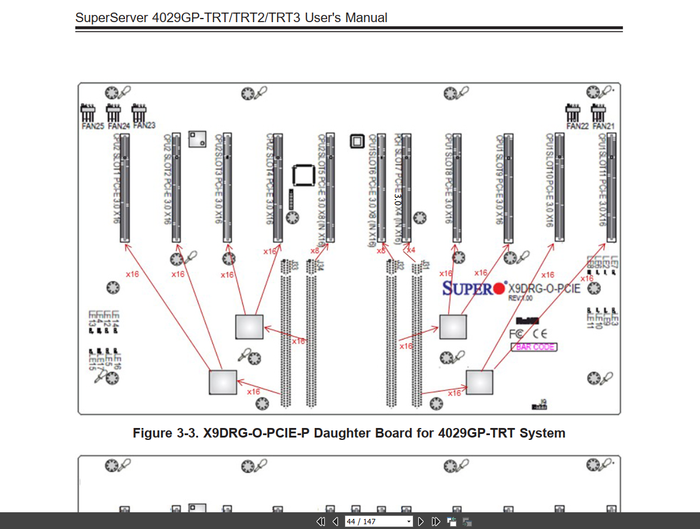

# 查看 NVIDIA 显卡状态

## 查看显卡设备

```sh
lspci -nn | grep -E "VGA|3D|Display"
```

```
00:01.0 VGA compatible controller [0300]: Device [1234:1111] (rev 02)
01:00.0 VGA compatible controller [0300]: NVIDIA Corporation GA102 [GeForce RTX 3080] [10de:2206] (rev a1)
02:00.0 VGA compatible controller [0300]: NVIDIA Corporation GA102 [GeForce RTX 3080] [10de:2206] (rev a1)
03:00.0 VGA compatible controller [0300]: NVIDIA Corporation GA102 [GeForce RTX 3080] [10de:2206] (rev a1)
04:00.0 VGA compatible controller [0300]: NVIDIA Corporation GA102 [GeForce RTX 3080] [10de:2206] (rev ff)
05:00.0 VGA compatible controller [0300]: NVIDIA Corporation GA102 [GeForce RTX 3080] [10de:2206] (rev a1)
06:00.0 VGA compatible controller [0300]: NVIDIA Corporation GA102 [GeForce RTX 3080] [10de:2206] (rev a1)
07:00.0 VGA compatible controller [0300]: NVIDIA Corporation GA102 [GeForce RTX 3080] [10de:2206] (rev a1)
08:00.0 VGA compatible controller [0300]: NVIDIA Corporation GA102 [GeForce RTX 3080] [10de:2206] (rev a1)
```

## 列出 PCI 总线 ID

```sh
lspci -Dnnd 10de: | grep -E "0300|0302" | awk '{print $1}' | sort
```

```sh
0000:01:00.0
0000:02:00.0
0000:03:00.0
0000:04:00.0
0000:05:00.0
0000:06:00.0
0000:07:00.0
0000:08:00.0
```

## 列出 NVIDIA GPU

```sh
nvidia-smi --query-gpu=index,pci.bus_id,name --format=csv,noheader | sort
```
```sh
Unable to determine the device handle for GPU3: 0000:04:00.0: Unknown Error
0, 00000000:01:00.0, NVIDIA GeForce RTX 3080
1, 00000000:02:00.0, NVIDIA GeForce RTX 3080
2, 00000000:03:00.0, NVIDIA GeForce RTX 3080
#  Missing :04:00.0
4, 00000000:05:00.0, NVIDIA GeForce RTX 3080
5, 00000000:06:00.0, NVIDIA GeForce RTX 3080
6, 00000000:07:00.0, NVIDIA GeForce RTX 3080
7, 00000000:08:00.0, NVIDIA GeForce RTX 3080
```

对比 `lspci` 和 `nvidia-smi` 的结果，可以看到掉卡的是 `0000:04:00.0`。

## 查看显卡详情

异常卡的信息：

```sh
sudo lspci -vvv -s 0000:04:00.0 | egrep -i "Physical Slot|LnkSta|LnkCap|Kernel driver|Subsystem"
```

```sh{4,5}
Subsystem: NVIDIA Corporation GA102 [GeForce RTX 3080 20GB]
Physical Slot: 0-6
        LnkCap: Port #0, Speed 16GT/s, Width x16, ASPM L0s L1, Exit Latency L0s <512ns, L1 <4us
        LnkSta: Speed 2.5GT/s (downgraded), Width x4 (downgraded)
        LnkCap2: Supported Link Speeds: 2.5-16GT/s, Crosslink- Retimer+ 2Retimers+ DRS-
        LnkSta2: Current De-emphasis Level: -6dB, EqualizationComplete- EqualizationPhase1-
Kernel driver in use: nvidia
```
```sh
# 或者只有一行
Kernel driver in use: nvidia
```

<details open><summary>查看正常卡的信息</summary>

```sh
sudo lspci -vvv -s 0000:05:00.0 | egrep -i "Physical Slot|LnkSta|LnkCap|Kernel driver|Subsystem"
```
```sh{4,5}
Subsystem: NVIDIA Corporation GA102 [GeForce RTX 3080 20GB]
Physical Slot: 0-5
        LnkCap: Port #0, Speed 8GT/s, Width x16, ASPM L0s L1, Exit Latency L0s <512ns, L1 <4us
        LnkSta: Speed 2.5GT/s (downgraded), Width x16 (ok)
        LnkCap2: Supported Link Speeds: 2.5-16GT/s, Crosslink- Retimer+ 2Retimers+ DRS-
        LnkSta2: Current De-emphasis Level: -6dB, EqualizationComplete+ EqualizationPhase1+
Kernel driver in use: nvidia
```

</details>

## 查看绑定驱动

```sh
sudo lspci -nnk -s 0000:04:00.0
```
```sh
04:00.0 VGA compatible controller [0300]: NVIDIA Corporation GA102 [GeForce RTX 3080] [10de:2206] (rev a1)
        Subsystem: NVIDIA Corporation GA102 [GeForce RTX 3080 20GB] [10de:146d]
        Kernel driver in use: nvidia
        Kernel modules: nvidiafb, nouveau, nvidia_drm, nvidia
```

## 在 PVE 中查看 VM 状态

### 列出 VM

```sh
qm list
```
```sh
VMID   NAME      STATUS    MEM(MB)   BOOTDISK(GB)   PID
 101   AI-122    running   94208          2048.00   3544
 301   win10     stopped   65536           500.00   0
```

### 停止 VM

```sh
qm stop 101
```

### 启动 VM

```sh
qm start 101
```

## 在 PVE 中查看 VM GPU 状态

### 列出 Slot 映射

```sh
dmidecode -t slot | awk -F': ' ' /Designation:/ {d=$2} /Bus Address:/ {print $2 "\t" d} ' | sort
```
```sh
0000:00:1c.0    PCH  Slot7 PCI-E 3.0 X4
0000:1a:00.0    CPU1 Slot10 PCI-E 3.0 X16
0000:1b:00.0    CPU1 Slot11 PCI-E 3.0 X16
0000:3d:00.0    CPU1 Slot8 PCI-E 3.0 X16
0000:3e:00.0    CPU1 Slot9 PCI-E 3.0 X16
0000:5d:00.0    CPU1 Slot6 PCI-E 3.0 X8
0000:88:00.0    CPU2 Slot1 PCI-E 3.0 X16
0000:89:00.0    CPU2 Slot2 PCI-E 3.0 X16
0000:b1:00.0    CPU2 Slot3 PCI-E 3.0 X16
0000:b2:00.0    CPU2 Slot4 PCI-E 3.0 X16
0000:d7:02.0    CPU2 Slot5 PCI-E 3.0 X8
```



图中从左到右分别为：
- 4x: `SLOT 1/2/3/4 (3.0x16)`
- 2x: `SLOT 5/6 (3.0x8)`
- 1x: `SLOT 7 (3.0x4)`
- 4x: `SLOT 8/9/10/11 (3.0x16)`

### SLOT 和 GPU 对应关系

一般显卡都插在 `SLOT 1/2/3/4` 和 `SLOT 8/9/10/11` 的 `3.0x16` 插槽上。
那么 8 张显卡的 PCIe BDF 和 SLOT 对应关系为：

```sh
    PCIe BDF       SLOT ID   GPU ID
--  ------------   -------   ------
 1  0000:88:00.0   SLOT  1   GPU 0
 2  0000:89:00.0   SLOT  2   GPU 1
 3  0000:b1:00.0   SLOT  3   GPU 2
 4  0000:b2:00.0   SLOT  4   GPU 3
 5  0000:3d:00.0   SLOT  8   GPU 4
 6  0000:3e:00.0   SLOT  9   GPU 5
 7  0000:1a:00.0   SLOT 10   GPU 6
 8  0000:1b:00.0   SLOT 11   GPU 7
```

### 列出 NVIDIA GPU 的 BDF

```sh
lspci -D | awk '/NVIDIA Corporation/ && /(VGA compatible controller|3D controller)/{print $1}'
```
```sh
0000:1a:00.0
0000:1b:00.0
0000:3d:00.0
0000:3e:00.0
0000:88:00.0
0000:89:00.0
0000:b1:00.0
0000:b2:00.0
```

### 查看直通 PCI 设备

```sh
qm config 101 | grep -E '^hostpci'
```

<details open>

```sh
hostpci0: 0000:3d:00,pcie=1
hostpci1: 0000:3e:00,pcie=1
hostpci2: 0000:1a:00,pcie=1
hostpci3: 0000:1b:00,pcie=1
hostpci4: 0000:b1:00,pcie=1
hostpci5: 0000:b2:00,pcie=1
hostpci6: 0000:89:00,pcie=1
hostpci7: 0000:88:00,pcie=1
```
</details>

`hostpciN` 是 PVE 配置键，也是 QEMU 设备 ID 的一部分；它不是 NVIDIA 的
GPU index，也不是稳定的 VM PCI 总线号。

注意：`hostpci` 被压缩或重排后，QEMU 会重新分配 PCIe root port 和 VM 内的
bus number。<m>不能用 `hostpciN` 的数字推算 VM 中的 `0000:BB:DD.F`</m>，也不能
复用上一次启动时记录的映射。运行中的 VM 必须以 QEMU `info pci` 为准。

### 查看设备映射

```sh
qm showcmd 101 --pretty | egrep -n "vfio-pci|hostpci" -n
```

<details>

```sh
28:  -device 'vfio-pci,host=0000:3d:00.0,id=hostpci0.0,bus=ich9-pcie-port-1,addr=0x0.0,multifunction=on' \
29:  -device 'vfio-pci,host=0000:3d:00.1,id=hostpci0.1,bus=ich9-pcie-port-1,addr=0x0.1' \
30:  -device 'vfio-pci,host=0000:3e:00.0,id=hostpci1.0,bus=ich9-pcie-port-2,addr=0x0.0,multifunction=on' \
31:  -device 'vfio-pci,host=0000:3e:00.1,id=hostpci1.1,bus=ich9-pcie-port-2,addr=0x0.1' \
32:  -device 'vfio-pci,host=0000:1a:00.0,id=hostpci2.0,bus=ich9-pcie-port-3,addr=0x0.0,multifunction=on' \
33:  -device 'vfio-pci,host=0000:1a:00.1,id=hostpci2.1,bus=ich9-pcie-port-3,addr=0x0.1' \
34:  -device 'vfio-pci,host=0000:1b:00.0,id=hostpci3.0,bus=ich9-pcie-port-4,addr=0x0.0,multifunction=on' \
35:  -device 'vfio-pci,host=0000:1b:00.1,id=hostpci3.1,bus=ich9-pcie-port-4,addr=0x0.1' \
37:  -device 'vfio-pci,host=0000:b1:00.0,id=hostpci4.0,bus=ich9-pcie-port-5,addr=0x0.0,multifunction=on' \
38:  -device 'vfio-pci,host=0000:b1:00.1,id=hostpci4.1,bus=ich9-pcie-port-5,addr=0x0.1' \
40:  -device 'vfio-pci,host=0000:b2:00.0,id=hostpci5.0,bus=ich9-pcie-port-6,addr=0x0.0,multifunction=on' \
41:  -device 'vfio-pci,host=0000:b2:00.1,id=hostpci5.1,bus=ich9-pcie-port-6,addr=0x0.1' \
43:  -device 'vfio-pci,host=0000:89:00.0,id=hostpci6.0,bus=ich9-pcie-port-7,addr=0x0.0,multifunction=on' \
44:  -device 'vfio-pci,host=0000:89:00.1,id=hostpci6.1,bus=ich9-pcie-port-7,addr=0x0.1' \
46:  -device 'vfio-pci,host=0000:88:00.0,id=hostpci7.0,bus=ich9-pcie-port-8,addr=0x0.0,multifunction=on' \
47:  -device 'vfio-pci,host=0000:88:00.1,id=hostpci7.1,bus=ich9-pcie-port-8,addr=0x0.1' \
```
</details>

`qm showcmd` 展示的是按当前配置生成的启动命令。排查已经运行的 VM 时，应读取
QEMU 的实时拓扑：

```sh
pvesh create /nodes/$(hostname)/qemu/101/monitor --command 'info pci'
```

### 查看内核日志

```sh
journalctl -k -b | egrep -i "vfio|D3cold|D3hot|device inaccessible|pcieport|retraining|AER|NVRM|Xid" | tail -n 300
```

<details>

```sh
Jan 15 01:48:25 pve kernel: vfio-pci 0000:89:00.1: resetting
Jan 15 01:48:25 pve kernel: vfio-pci 0000:89:00.0: reset done
Jan 15 01:48:25 pve kernel: vfio-pci 0000:89:00.1: reset done
Jan 15 01:48:25 pve kernel: vfio-pci 0000:88:00.0: Unable to change power state from D3cold to D0, device inaccessible
Jan 15 01:48:26 pve kernel: vfio-pci 0000:88:00.0: timed out waiting for pending transaction; performing function level reset anyway
Jan 15 01:48:26 pve kernel: vfio-pci 0000:88:00.1: Unable to change power state from D3cold to D0, device inaccessible
Jan 15 01:48:26 pve kernel: vfio-pci 0000:88:00.0: resetting
Jan 15 01:48:26 pve kernel: vfio-pci 0000:88:00.0: Unable to change power state from D3cold to D0, device inaccessible
Jan 15 01:48:26 pve kernel: vfio-pci 0000:88:00.1: resetting
Jan 15 01:48:26 pve kernel: vfio-pci 0000:88:00.1: Unable to change power state from D3cold to D0, device inaccessible
Jan 15 01:48:27 pve kernel: pcieport 0000:87:08.0: Data Link Layer Link Active not set in 100 msec
Jan 15 01:48:27 pve kernel: vfio-pci 0000:88:00.0: reset done
Jan 15 01:48:27 pve kernel: vfio-pci 0000:88:00.1: reset done
Jan 15 01:48:27 pve kernel: vfio-pci 0000:88:00.1: Unable to change power state from D3cold to D0, device inaccessible
Jan 15 01:48:27 pve kernel: vfio-pci 0000:88:00.0: Unable to change power state from D3cold to D0, device inaccessible
```

</details>

## 排查正在运行的直通 GPU 掉卡

### 先在 VM 内保留故障现场

不要先重启 VM。先找出发生 Xid 79 的 VM BDF，并检查该端点是否已经变成
`rev ff`：

```sh
nvidia-smi

for f in /proc/driver/nvidia/gpus/*/information; do
  index=$(awk -F: '/Device Minor:/ {gsub(/[[:space:]]/, "", $2); print $2}' "$f")
  nvidia-smi -i "$index" \
    --query-gpu=index,name,pci.bus_id,temperature.gpu,pstate,power.draw \
    --format=csv,noheader
  echo "index=$index rc=$?"
done

lspci -Dnn | grep -i NVIDIA
journalctl -k -b -o short-iso --no-pager \
  | grep -Ei 'NVRM: Xid|fallen off the bus|PCIe Bus Error'
```

::: warning
一次掉卡后，整张 `nvidia-smi` 表仍可能返回成功，同时直接漏掉故障行。因此需要
逐 index 检查返回码，并和 `/proc/driver/nvidia/gpus/*/information`、`lspci`
交叉验证。
:::

判断日志时：

- `Xid 79: GPU has fallen off the bus` 所在的 BDF 才是主要故障端点。
- 同一时刻其他 GPU 上的 `Xid 154: Node Reboot Required` 可能只是全局恢复动作，
  不能据此把所有 GPU 都隔离。
- VM 中的 `rev ff` 表示配置空间已经无法读取，是掉卡的强证据。

### 从 VM BDF 映射到宿主机 BDF

使用只读诊断脚本，参数是 VM 内 Xid 79 对应的 BDF：

```sh
/root/diagnose_vm_gpu.sh 101 0000:06:00.0
```

输出形如：

```txt
guest_bdf=0000:06:00.0
qemu_id=hostpci2.0
hostpci_key=hostpci2
host_bdf=0000:3e:00
host_config_vendor=ffff
physical_slot=CPU1 Slot9 PCI-E 3.0 X16
numa_node=0
iommu_group=10
endpoint_health=unresponsive
```

脚本还会打印 sysfs 拓扑和各级上游桥的 `LnkSta`、`DevSta`、`UESta`、
`CESta`。其中最有价值的是故障卡的直接上游端口：

```txt
LnkSta: Speed 5GT/s, Width x0
DevSta: CorrErr+ NonFatalErr+ FatalErr+
UESta: ... SDES+ ...
```

这组状态表示 PLX 下游链路发生 Surprise Down。排查顺序应优先放在对应物理槽位的
显卡供电、PSU 端连接、线缆/转接板、插槽和接触问题，而不是 NVIDIA 驱动。

::: tip
`lspci -Dnn -s HOST_BDF` 可能仍显示缓存的型号和 `rev a1`，不能单独证明设备健康。
应读取实时配置空间：

```sh
setpci -s 3e:00.0 VENDOR_ID.w
```

正常 NVIDIA 端点应返回 `10de`；`ffff` 或无响应表示端点已经失联。直通场景下，
PVE 内核日志在故障时段也可能没有 AER 记录，不能用“宿主机日志为空”否定 VM 内
Xid 79、配置空间 `ffff` 和上游 `Width x0/SDES+` 的证据链。
:::

只读诊断脚本：

<<< @/notes/scripts/pve-vm/diagnose_vm_gpu.sh

### 隔离故障卡并安全重启

确认宿主机 BDF 后，先写入持久隔离记录：

```sh
/root/qm_gpus.sh 101 --quarantine 0000:3e:00 \
  --reason 'guest Xid 79; host config ffff; upstream Width x0 and SDES+'
```

优先使用 guest agent 优雅关机，并禁止自动强停：

```sh
qm shutdown 101 --timeout 300 --forceStop 0
```

如果返回 `VM quit/powerdown failed`，只有在 guest agent 已经持续不可用、关机任务
已经退出且 VM 锁没有持有者时，才停止残留 QEMU：

```sh
timeout 10 qm guest cmd 101 ping
fuser /run/lock/qemu-server/lock-101.conf
qm stop 101 --timeout 60 --overrule-shutdown 1
```

`qm stop` 等价于断电，应视为优雅关机失败后的最后手段。VM 停止后再运行：

```sh
/root/start_vm101.sh 101
```

启动脚本支持同时保留多条隔离记录，会重新检测剩余卡、执行联合 VFIO 探测，
并将配置压缩成连续的 `hostpci0..N`。压缩后 VM 内 GPU index 和 PCI bus 会改变，
后续定位必须重新采集实时映射。

### 两次故障记录和新增结论

| 日期 | VM 故障 BDF | 实时 QEMU ID | PVE BDF | 物理槽位 | 直接上游状态 |
| --- | --- | --- | --- | --- | --- |
| 2026-08-14 | `0000:07:00.0` | `hostpci2.0` | `0000:b2:00` | CPU2 Slot4 | `b0:10.0`，`Width x0`、`SDES+` |
| 2026-08-23 | `0000:06:00.0` | `hostpci2.0` | `0000:3e:00` | CPU1 Slot9 | `3c:10.0`，`Width x0`、`SDES+` |

两次事件中的 `hostpci2.0` 实际对应不同显卡，直接证明配置重排后不能复用历史映射。
两张卡又分属不同 CPU/PLX 树，但都在 PLX Port 16 下游突然断链，因此除了各自插槽，
还应检查共用的 PSU、供电分配、同型号线缆/转接板和装配方式。

修复硬件并冷启动 PVE 后，先确认配置空间恢复为 `10de`、上游链路宽度不再是
`x0`。在 VM 停止状态下运行完整恢复验证；脚本只会在生产 VM 成功枚举后清除已
恢复卡的隔离记录：

```sh
/root/start_vm101.sh 101 --revalidate-quarantined
```

## 在 PVE 中添加 GPU 设备

### 查看直通的显卡

```sh
lspci -D | awk '/NVIDIA Corporation/ && /(VGA compatible controller|3D controller)/{print $1}'
```

### 删除之前的显卡直通设置

```sh
for i in {0..7}; do qm set 101 -delete hostpci$i; done
```

### 指定显卡组合

下面仅是手动配置示例。发生过隔离或配置压缩后，不要复制历史组合代替实时检查；
优先使用 `qm_gpus.sh` 和持久隔离清单。

```sh
# [显卡组合1]: (x8: 12345678)
buses=(88 89 b1 b2 3d 3e 1a 1b); args=()
# [显卡组合2]: (x5: 34567)
buses=(b1 b2 3d 3e 1a); args=()
# [显卡组合3]: (x6: 234567)
buses=(89 b1 b2 3d 3e 1a); args=()
```

### 设置 `hostpci` 参数

```sh
for i in "${!buses[@]}"; do args+=("-hostpci$i" "0000:${buses[$i]}:00,pcie=1"); done
```

```sh
qm set 101 "${args[@]}"
```

### 启动 VM

```sh
qm start 101
```

### 保存到一键脚本

`qm_gpus.sh`:

<<< @/notes/scripts/pve-vm/qm_gpus.sh
