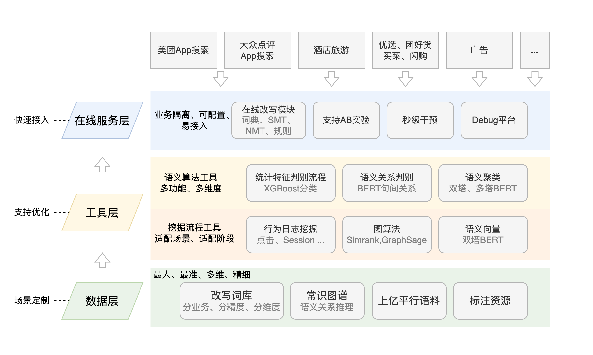

# 搜索系统资料选读

::: timeline 
## [[2024-02-08] 推荐系统公开课——8小时完整版，讲解工业界真实的推荐系统](https://www.bilibili.com/video/BV1HZ421U77y)
自古搜索和推荐不分家。王树森老师的这个长达 8 小时的公开课，虽说讲的是小红书笔记的推荐系统，但对于搜索领域和其他内容形式也是同样适用的。这个公开课内容很干，王老师几乎没有半句废话，值得搬好小板凳认真听讲。

里面有一些工程方案和技术其实是过时或者效果不好的，所以不必认真研究每个技术知识点，毕竟技术方案是永远追不完的。重要的是思考这些技术和工程方法是源自什么问题，以及研究者当初是处在什么环境、用什么视角去审视和解决他所提出的问题。

后面有空出一期要点总结。为了避免我自己[求全求细的恶习复发](./faq#这个系列文章应当注意什么)，可能尽可能迫使自己仅凭记忆口述，并且挑其中印象深刻的要点来写，而不是一字不落地原文整理。

最近王树森老师也开始陆续发“搜索引擎”的课了，我会持续跟进。

:::

::: timeline
## [[2022-02-17] 美团搜索中查询改写技术的探索与实践 - 美团技术团队](https://tech.meituan.com/2022/02/17/exploration-and-practice-of-query-rewriting-in-meituan-search.html)
这篇文章讲得很系统，尤其是基于业务实践，给出了各种方案的来龙去脉和优劣取舍，工程感满满。<f>美团技术团队出品，必属精品。</f>其实不要特别在意具体的技术细节，学习下主要的方法和思路即可，以及这篇文章是如何在业务实践逐步引入各种技术方案，最终形成一个完整的技术体系的。

<tip>

<b>摘要</b>

本文主要介绍前一种解决漏召回的方案：<m>查询改写</m>。查询改写的应用方式是对原始 Query 拓展出与用户需求关联度高的改写词，多个改写词与用户搜索词一起做检索，从而用更好的表述，帮用户搜到更多符合需求的商户、商品和服务。

在美团搜索的技术架构下，<m>查询改写控制召回语法中的文本，命名实体识别控制召回语法中的检索域，意图识别控制召回的相关性以及各业务的分流和产品形态</m>，这是最为核心的三个查询理解信号。查询改写策略在美团搜索的全部流量上生效，除扩展用户搜索词外，在整个美团搜索技术架构中作为基础语义理解信号，从索引扩展、排序特征、前端高亮等多方面影响着用户体验。对搜索召回结果中的无结果率、召回结果数以及搜索点击率等指标，也有着直接且显著的影响。

</tip>

<tip>

<b>NMT + 强化学习</b>

因此要引入 NMT 做改写必须结合搜索的使用场景对以上两个问题（分词粒度引入的挖掘效率问题、语义相近不能对齐的复杂 Query 改写问题）做优化，目标是生成无意图漂移、能够产生实际召回影响的改写词。基于以上问题分析和思考，<m>通过引入环境因素引导 NMT 生成更高质量的改写是大方向目标</m>，从这个角度出发我们调研了强化学习的方法。

强化学习的过程是一个智能体（Agent）采取行动（Action）从而改变自己的状态（State）获得奖励（Reward）与环境（Environment）发生交互的循环过程。我们希望借助强化学习的思想，将预训练的 NMT 改写模型作为 Agent，在强化学习迭代的过程中其生成的改写（Action）通过搜索系统（Environment）产生最终的曝光和点击（Reward）来指导NMT优化模型参数（State）。

经过进一步调研，我们参考了 Google QA 系统[21]以及知乎的工作[22]，即通过强化学习的方法，把搜索系统当做一个 Environment，改写模型当做 Agent，从而将大搜的结果质量考虑进来。……结合 NMT 实际的表现，<m>考虑优先保障生成改写的语义相似度</m>，使用大搜召回日志结合 BERT 语义判别模型做 Environment，<m>目标为原词改写词在搜索系统交互中的商户集合的交叉度和自然语义相似度</m>。

</tip>

着重学习下原文这个部分，是怎么定义强化学习模型中的环境和目标的。

最终，整个查询改写平台技术框架如下图所示：

文末推荐了阿里巴巴的 AliCoCo，对词关系的研究更为充分，找来看看。

深入了解一个领域的方法之一，就是谷歌搜索几篇系统全面的好文，然后基于这些好文给出的参考文献顺藤摸瓜，无论是 DFS 还是 BFS 都可。比如上面王树森老师的视频里，就给了不少有空的参考文献。再比如这篇其实就是 Google 关键词“搜索召回”返回的第二条结果。

:::

::: timeline
## [[2020-03-30] AliCoCo: Alibaba E-commerce Cognitive Concept Net](https://arxiv.org/abs/2003.13230)
[abs](https://arxiv.org/abs/2003.13230) · [pdf](https://arxiv.org/pdf/2003.13230) · [html](https://ar5iv.labs.arxiv.org/html/2003.13230)

<m>（待看）</m>
:::